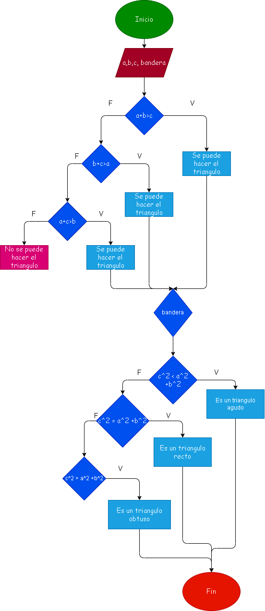

# 2. Ejercicio de triangulos :Determinar si un triangulo es obtuso recto o agudo.

# Analisis
Un triángulo agudo tiene sus tres ángulos de menos de 90° (agudos); y un triángulo obtuso posee un ángulo mayor de 90° (obtuso) y dos ángulos agudos. 

