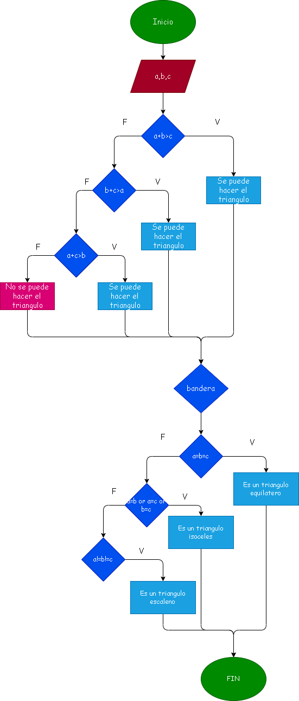

# 3. Ejercicio de triangulos :Determinar si un triangulo es equilatero, isoceles o escaleno. 

# Analisis
 Triángulo isósceles: presenta dos lados de igual medida. Triángulo equilátero: los tres lados miden lo mismo y por lo tanto los tres ángulos son iguales. Triángulo escaleno: sus tres lados tienen diferentes medidas. 

